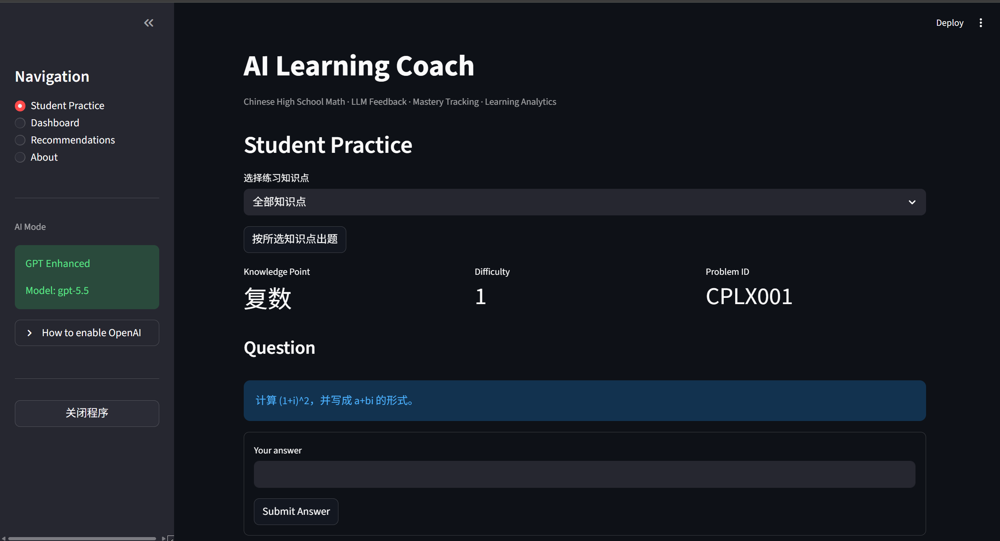
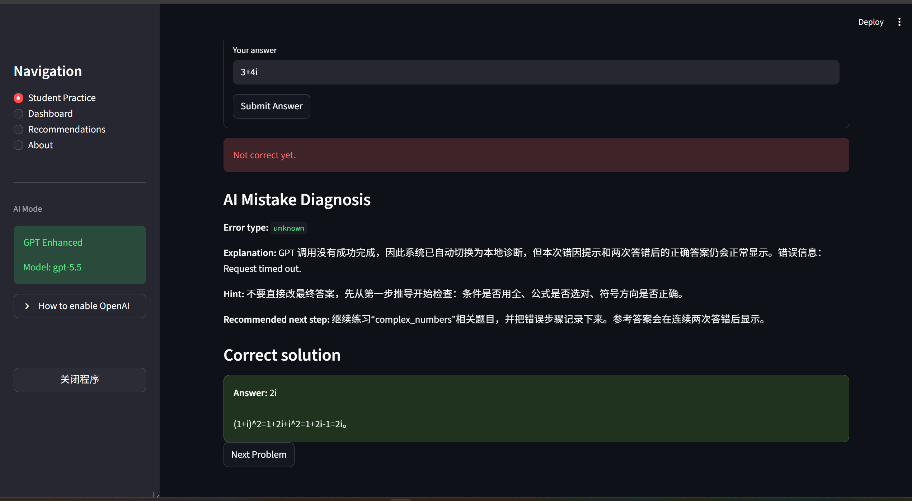

# AI Learning Analytics Coach

An AI-powered mathematics learning platform featuring Learning Analytics, Knowledge Tracing, Forgetting Curve Modeling, Personalized Recommendations, and GPT-based Mistake Diagnosis.

---

# Project Highlights

This project demonstrates the integration of:

- Artificial Intelligence
- Data Science
- Learning Analytics
- Educational Technology
- Human Learning Modeling
- Personalized Recommendation Systems

---

# System Screenshots

1. Student Practice Page


3. AI Mistake Diagnosis


4. Knowledge Mastery Dashboard

5. Recommendation Engine

6. Learning Analytics Visualization


---

# System Architecture

```text
Student
   |
   v
Streamlit Frontend
   |
   +-------------------+
   |                   |
   v                   v
SQLite Database     OpenAI API
   |                   |
   v                   v
Learning Records   AI Diagnosis
   |
   v
Knowledge Tracing Engine
   |
   v
Forgetting Curve Model
   |
   v
Recommendation Engine
   |
   v
Dashboard & Feedback
```

---

# Learning Analytics Framework

The platform combines:

### Knowledge Tracing

Tracks mastery for each knowledge point.

Mastery score:

```text
0.0 ~ 1.0
```

Update rule:

```text
new_mastery =
old_mastery +
learning_rate × difficulty_weight × outcome
```

where:

- outcome = +1 (correct)
- outcome = -1 (incorrect)

---

### Forgetting Curve

Adjusted mastery:

```text
adjusted_mastery =
mastery × exp(-days_since_last_practice / 30)
```

This models memory decay over time.

---

# AI Mistake Diagnosis Workflow

```text
Student Answer
      |
      v
Answer Evaluation
      |
      +------------------+
      |                  |
 Correct            Incorrect
      |                  |
      v                  v
Update Mastery      GPT Analysis
                         |
                         v
                 Error Type
                 Explanation
                 Hint
                 Next Step
```

Supported error types:

- conceptual_error
- calculation_error
- careless_error
- misunderstanding_question
- unknown

---

# Database Schema

## attempts

| Field | Description |
|---------|-------------|
| timestamp | Submission time |
| problem_id | Problem ID |
| student_answer | Student answer |
| correct_answer | Correct answer |
| is_correct | Correctness |
| knowledge_point | Knowledge point |
| difficulty | Difficulty |
| response_time_seconds | Response time |

---

## mastery

| Field | Description |
|---------|-------------|
| knowledge_point | Knowledge point |
| mastery_score | Current mastery |
| last_practiced | Last practice date |

---

# Core Features

## Student Practice System

- One question at a time
- Knowledge-point filtering
- Difficulty levels
- Response-time tracking
- SQLite persistence

---

## AI Mistake Diagnosis

### GPT-Enhanced Mode

Provides:

- Error classification
- Personalized explanation
- Learning hints
- Recommended next steps

### Demo Mode

Automatic fallback when:

```env
OPENAI_API_KEY
```

is not configured.

---

## Knowledge Mastery Tracking

Tracks:

- Learning progress
- Weak knowledge areas
- Improvement trends

---

## Learning Analytics Dashboard

Displays:

- Raw mastery
- Adjusted mastery
- Attempt count
- Accuracy
- Common error types
- Last practice date

Visualizations:

- Bar chart
- Accuracy trend chart
- Learning statistics cards

---

## Recommendation Engine

Considers:

- Low mastery
- High error frequency
- Long review intervals

Generates:

- Practice recommendations
- Personalized learning plans
- New practice questions

---

# Technology Stack

## Backend

- Python
- SQLite

## Frontend

- Streamlit

## Data Analysis

- Pandas
- Matplotlib

## AI

- OpenAI API

---

# Installation

Install dependencies:

```bash
pip install -r requirements.txt
```

or

```bash
install_requirements.bat
```

---

# Running

```bash
streamlit run app.py
```

or

```bash
run_app.bat
```

---

# OpenAI Configuration

Create:

```text
.env
```

Example:

```env
OPENAI_API_KEY=your_api_key_here
OPENAI_MODEL=gpt-4o-mini
```

Without an API key, the application automatically switches to Demo Mode.

---

# Future Work

Potential future improvements:

### Machine Learning

- Bayesian Knowledge Tracing (BKT)
- Deep Knowledge Tracing (DKT)
- Item Response Theory (IRT)

### AI

- Retrieval-Augmented Generation (RAG)
- Multi-Agent Tutoring System
- Adaptive Curriculum Planning

### Data Science

- Student Clustering
- Learning Path Optimization
- Predictive Performance Modeling

---

# 中文说明

## 项目简介

AI Learning Analytics Coach 是一个融合：

- 学习分析（Learning Analytics）
- 知识追踪（Knowledge Tracing）
- 遗忘曲线建模（Forgetting Curve）
- 大语言模型（LLM）

的智能学习平台。


---

## 中文功能概览

- 学生练习系统
- AI错因诊断
- 掌握度追踪
- 遗忘曲线建模
- 学习分析仪表盘
- 个性化推荐系统
- GPT增强学习反馈

